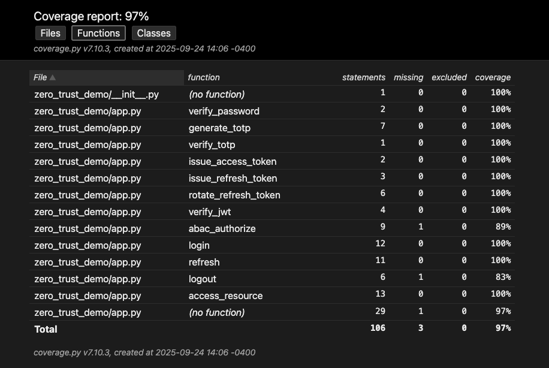
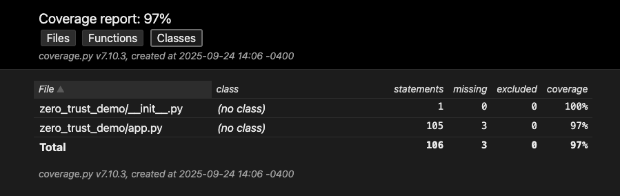
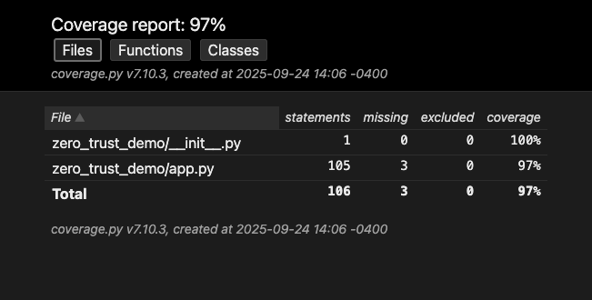

# Zero Trust Demo API (Flask + JWT + ABAC + Refresh Token Rotation)

This project is a **Zero Trust authentication and authorization demo API** built with Python (Flask).

It demonstrates modern security practices:

* Password + **MFA (TOTP)** authentication
* **Context-aware login** (IP, device fingerprint)
* **ABAC (Attribute-Based Access Control)** for fine-grained authorization
* Short-lived **JWT access tokens**
* **Refresh tokens with rotation**
* Refresh token **revocation / logout**
* **Integration tests** using `pytest`
* Preconfigured **Postman collection** and **curl** examples

---

## 📂 Project Structure

```
zero_trust_demo/
│
├── app.py                     # Flask API implementation
├── requirements.txt           # Project dependencies
├── README.md                  # Project documentation
├── postman_collection.json    # Postman collection with example requests
└── tests/
    └── test_api.py            # Pytest integration tests
```

---

## 🚀 Getting Started

### 1. Clone the Repository

```bash
git clone https://github.com/asearer/zero_trust_demo.git
cd zero_trust_demo
```

### 2. Create a Virtual Environment

```bash
python3 -m venv venv
source venv/bin/activate   # macOS/Linux
venv\Scripts\activate      # Windows
```

### 3. Install Dependencies

```bash
pip install -r requirements.txt
```

---

## ▶️ Running the API

Start the Flask app:

```bash
python app.py
```

The API will be available at:

```
http://127.0.0.1:5000
```

---

## 🔑 API Endpoints

### `POST /login`

Authenticate with username, password, and MFA. Returns **access token** + **refresh token**.

**Example Request:**

```json
{
  "username": "alice",
  "password": "SuperSecret123",
  "mfa_code": "123456",
  "device": "laptop-001"
}
```

---

### `POST /refresh`

Exchange a valid refresh token for a new access token. Automatically rotates refresh tokens.

**Example Request:**

```json
{
  "refresh_token": "<refresh_token>",
  "device": "laptop-001"
}
```

---

### `POST /logout`

Revoke a refresh token.

**Example Request:**

```json
{
  "refresh_token": "<refresh_token>"
}
```

---

### `POST /resource`

Access a protected resource with ABAC enforcement. Requires `Authorization: Bearer <access_token>` header.

**Example Request:**

```json
{
  "action": "read",
  "resource": "data"
}
```

---

## ✅ Running Tests

This project includes automated integration tests using **pytest**.

Run all tests:

```bash
pytest -v
```

Tests cover:

* Successful and failed login attempts
* MFA validation
* Access control decisions (ABAC)
* Refresh token rotation
* Logout and revoked token handling

### 🖼 Test Result Screenshots

#### Function Tests




#### Class Tests



#### Files Tests




---

## 📬 Testing with Postman or curl

### Postman

Import the included collection:

```
postman_collection.json
```

This will give you preconfigured requests for:

* **Login** (get access & refresh tokens)
* **Refresh Token**
* **Logout**
* **Access Resource**

---

### curl Examples

**1. Login**

```bash
curl -X POST http://127.0.0.1:5000/login \
  -H "Content-Type: application/json" \
  -d '{
    "username": "alice",
    "password": "SuperSecret123",
    "mfa_code": "123456",
    "device": "laptop-001"
  }'
```

**2. Refresh Token**

```bash
curl -X POST http://127.0.0.1:5000/refresh \
  -H "Content-Type: application/json" \
  -d '{
    "refresh_token": "<refresh_token>",
    "device": "laptop-001"
  }'
```

**3. Logout**

```bash
curl -X POST http://127.0.0.1:5000/logout \
  -H "Content-Type: application/json" \
  -d '{
    "refresh_token": "<refresh_token>"
  }'
```

**4. Access Resource**

```bash
curl -X POST http://127.0.0.1:5000/resource \
  -H "Authorization: Bearer <access_token>" \
  -H "Content-Type: application/json" \
  -d '{
    "action": "read",
    "resource": "data"
  }'
```

---

## 🔒 Notes

* This project is a **demo**. Do not use secrets or in-memory stores in production.
* For real-world use:

  * Store user credentials & refresh tokens in a secure DB (PostgreSQL, Redis, etc.)
  * Use HTTPS everywhere
  * Protect and rotate `SECRET_KEY` securely
  * Integrate with enterprise identity providers (OIDC, SAML)


